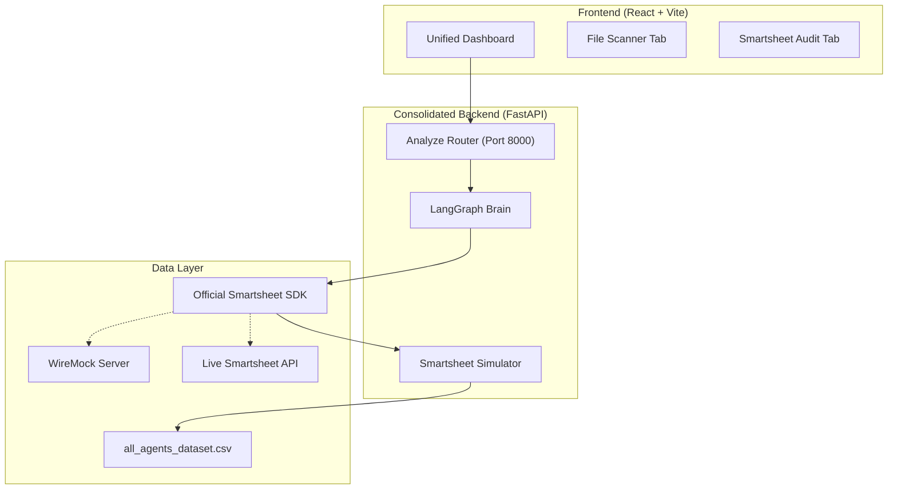
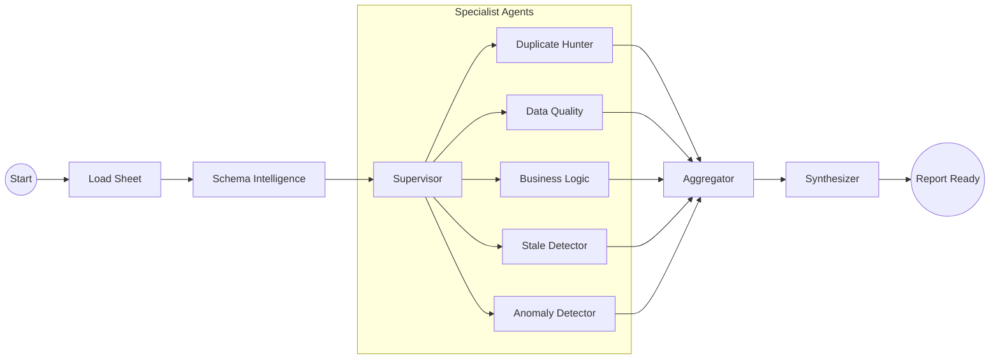

# SmartAgent — AI-Powered Smartsheet Data Auditing Agent

**SmartAgent** is a sophisticated, LangGraph-powered auditing suite integrated into the EZYerrScanner ecosystem. It automates the detection of data quality issues across Smartsheet sheets, proposes AI-driven corrective actions, and executes them with a **Human-in-the-Loop (HITL)** approval step.

---


## 🏗️ System Architecture

SmartAgent operates as a specialized module within the unified EZYerrScanner platform. It leverages a centralized FastAPI backend and a custom LangGraph "Brain" to process complex auditing tasks.



---

## 🧠 The LangGraph "Brain" (How it Thinks)

The auditing process is managed by a **Stateful Multi-Agent Workflow**. Instead of a simple linear script, SmartAgent uses a supervisor-specialist pattern to analyze data from multiple dimensions.

### The Audit Pipeline



### Node Explanations:
- **Supervisor**: Analyzes the sheet metadata and decides which specialist agents are relevant (e.g., skips "Anomaly Detector" if no numeric columns are present).
- **Specialist Agents**: Industry-specific logic designed to find duplicates, missing values, status conflicts, and budget overruns.
- **Aggregator**: Deduplicates findings and calculates an overall **Health Score**.
- **Synthesizer**: Generates the executive summary and top priorities for the final report.

---

## 🔄 The 5-Step Auditing Workflow

SmartAgent follow a rigorous Step-by-Step execution process to ensure data integrity and user control.

1.  **Connect**: Initializes the link with the Smartsheet API or the local Simulator.
2.  **Select Sheet**: Displays a list of accessible sheets for scanning.
3.  **Analyze**: Triggers the LangGraph Brain. This is a **read-only** phase that generates AI findings.
4.  **Review Actions (HITL)**: **Crucial Step.** The AI proposes specific changes (Comments, Cell Updates). You review, approve, or discard each one.
5.  **Execute**: The system uses the **Official Smartsheet SDK** to apply only the **approved** actions back to the sheet.

---

## 🚀 How to Run

### One-Click Startup (Recommended)
From the project root, run the unified launcher:
```powershell
.\run_scanner.ps1
```

### Manual Execution
If you prefer running components separately:

**Backend:**
```powershell
cd smartagent/backend
.\venv\Scripts\python.exe -m uvicorn main:app --port 8000 --reload
```

**Frontend:**
```powershell
cd frontend
npm run dev
```

---

## 🧪 Simulation Mode vs Live Mode

SmartAgent includes a **Local Simulator** that allows you to test the full lifecycle without a Smartsheet account.

- **Simulator Mode**: Set `USE_SIMULATOR=true` in `.env`. It reads from `all_agents_dataset.csv`.
- **Live Mode**: Set `USE_SIMULATOR=false` and provide your `SMARTSHEET_ACCESS_TOKEN`.

> [!IMPORTANT]
> **Developer Note on Connectivity**: Every write operation in SmartAgent (like adding comments or updating cells) is routed through the **Official Smartsheet Python SDK**. Even in simulator mode, the SDK thinks it is talking to a real API, ensuring production-ready reliability.
